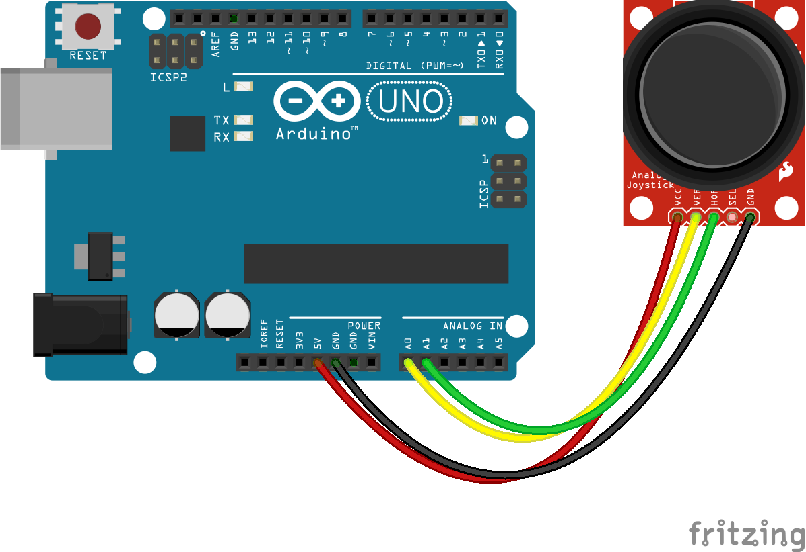

# Snake w przeglądarce sterowany joystickem

---

---

## Krok 1: Arduino



Układ podłączamy według schematu powyżej. 


W Arduino IDE na płytkę wgrywamy StandardFirmataPlus. Wgranie protokołu Firmata pozwoli  na komunikację z serwerem.

[Standard Firmata Plus firmware backup for Johnny Five](https://gist.github.com/cookiengineer/4f292c952209e0f74d4c18b995dac855)

---

## Krok 2: Back-end

Serwer [Node.js](https://nodejs.org/en/) postawiony w oparciu o [Express.js](http://expressjs.com/). Serwer z przeglądarką porozumiewa się przy użyciu  [Socket.io](https://socket.io/). Komunikację z płytką umożliwia platforma [Johnny-Five](http://johnny-five.io/).

```jsx

...
board.on("ready", () => {
    const joystick = new Joystick({
        //   [ x, y ]
        pins: ["A0", "A1"]
    });
    io.on('connection', (socket) => {
       joystick.on("change", function () {
           if (this.x <= -0.9 && !(this.x > 0)) socket.emit('left');
           if (this.x >= 0.9 && !(this.x < 0)) socket.emit('right');
           if (this.y <= -0.9 && !(this.y > 0)) socket.emit('up');
           if (this.y >= 0.9 && !(this.y < 0)) socket.emit('down');
       });
    })
    http.listen(config.port, () => {
       console.log(`app listening at http://localhost:${config.port}`)
    })
})
...
```

Całość kodu dostępna w repozytorium.

[tulski/joystick-snake](https://github.com/tulski/joystick-snake/blob/master/src/server.js)

---

## Krok 3: Front-end

[S](https://styled-components.com/)erwer wyżej serwuje statyczny plik HTML. Layout stworzony przy użyciu elementu `<canvas id="game">`.  Po wyemitowaniu odpowiedniej wiadomości w serwerze przechwytujemy ją po stronie przeglądarki i zmieniamy kierunek węża. 

```jsx
...
    const moveLeft = () => {
        snake.dx = -grid;
        snake.dy = 0;
    }
    const moveRight = () => {
        snake.dx = grid;
        snake.dy = 0;
    }
    const moveUp = () => {
        snake.dy = -grid;
        snake.dx = 0;
    }
    const moveDown = () => {
        snake.dy = grid;
        snake.dx = 0;
    }

    socket.on('left', moveLeft)
    socket.on('right', moveRight)
    socket.on('up', moveUp)
    socket.on('down', moveDown)
...
```

Całość kodu dostępna w repozytorium.


[tulski/joystick-snake](https://github.com/tulski/joystick-snake/blob/master/static/index.html)

---

## Efekt

Repozytorium:

[tulski/joystick-snake](https://github.com/tulski/joystick-snake)

Prezentacja działania:

[Joystick Snake](https://www.youtube.com/watch?v=gd5adrq-pCY)
